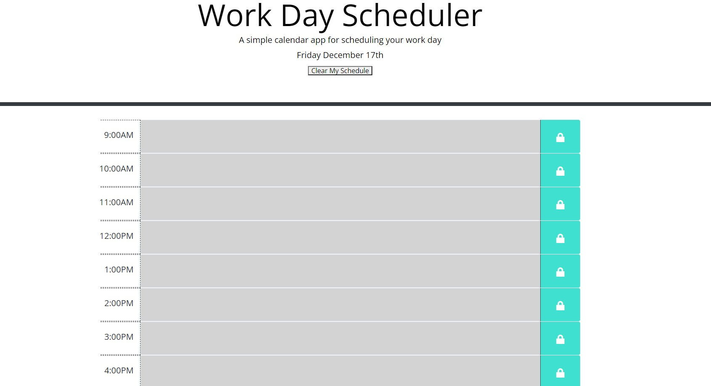

# Work Day Scheduler 

## Purpose
A simple work scheduler that lets you enter and save events. The rows are color coded relative to the current time.

## Built With
* HTML
* CSS
* BOOTSTRAP
* JAVASCRIPT
* JQUERY

## Website
https://ryanweiler92.github.io/Work-Day-Scheduler-/

## Contribution
Made by Ryan Weiler
